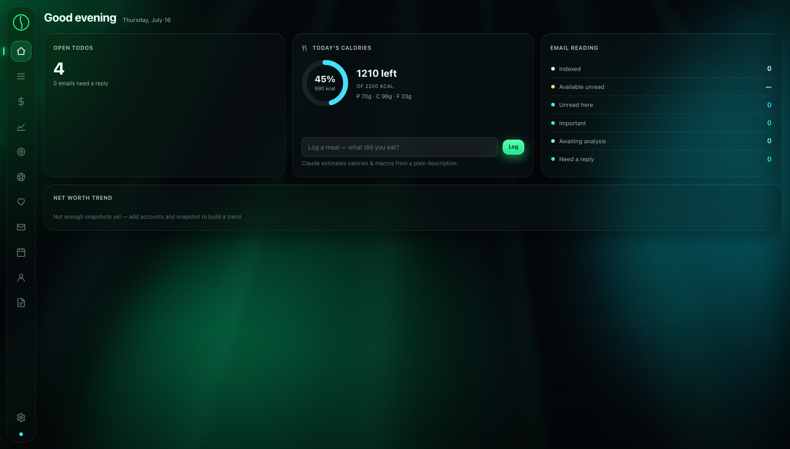
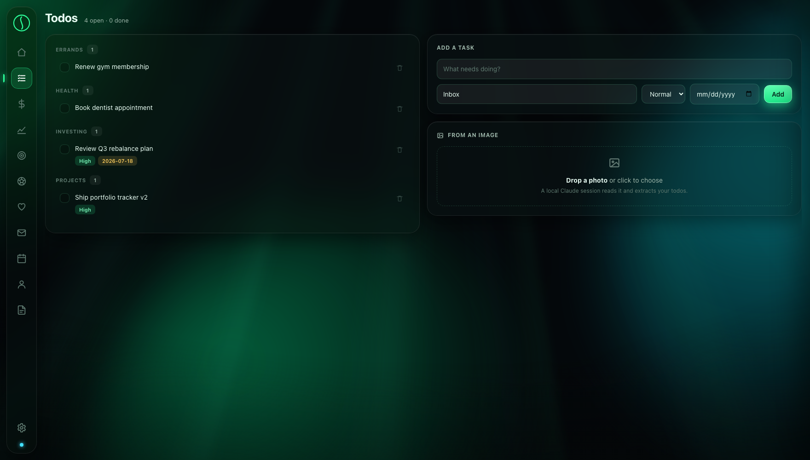
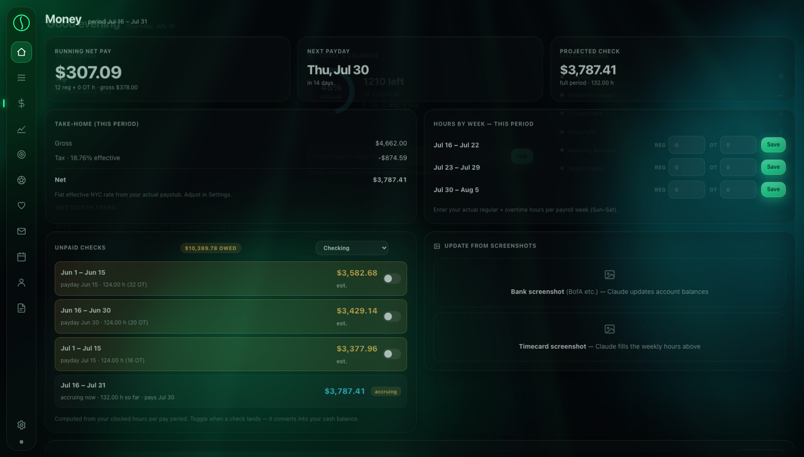
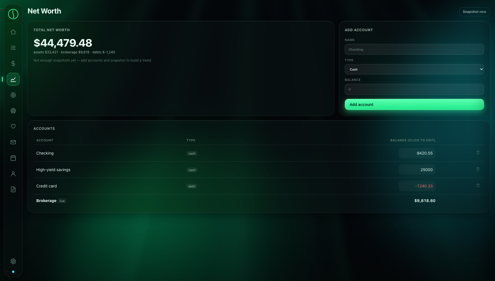
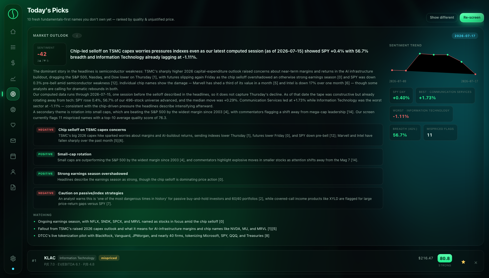
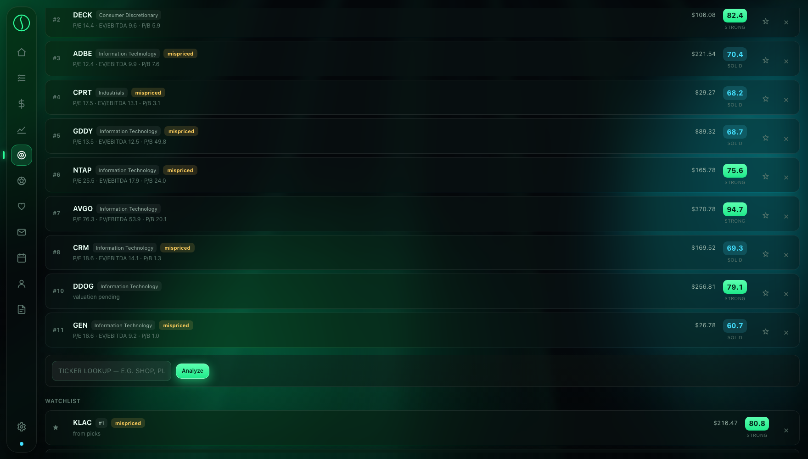
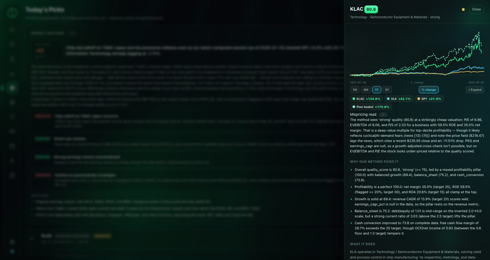
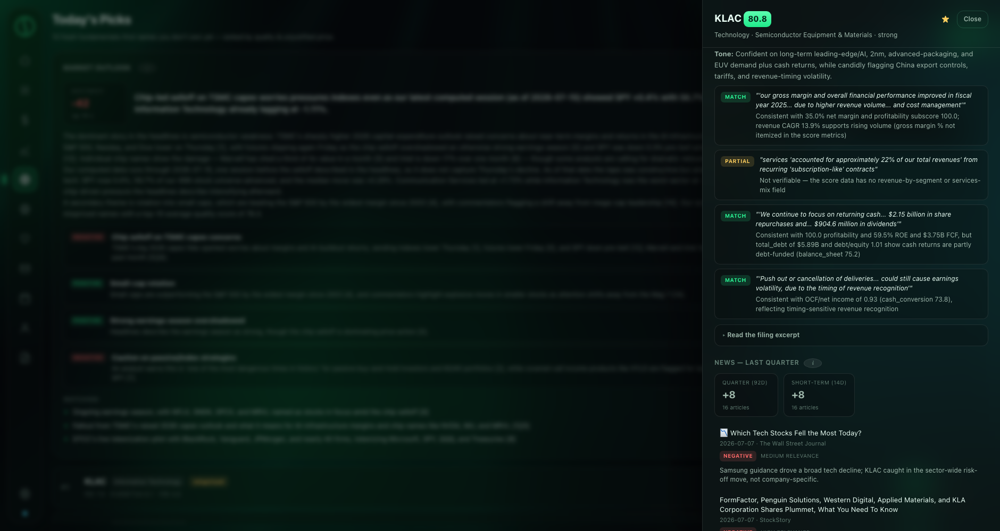
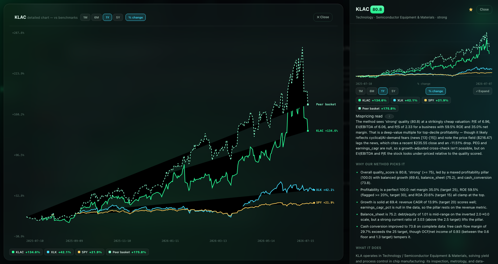
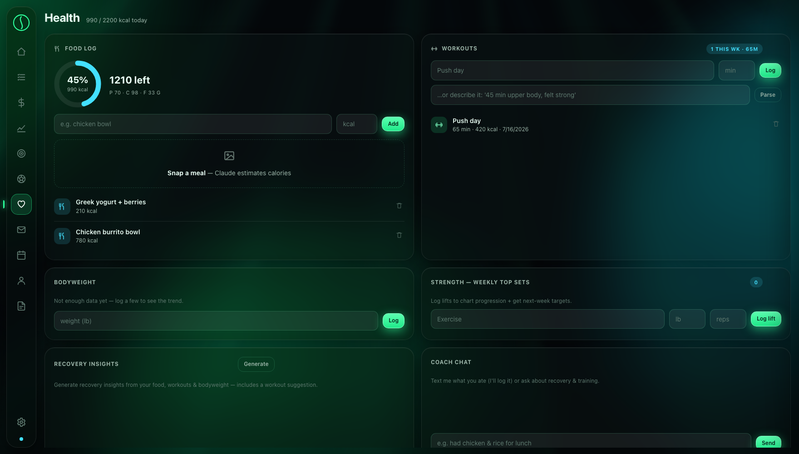

<div align="center">

# ⚫ ATLAS

**A fully-local life dashboard — money, markets, health, and time in one frosted-glass pane.**


*Everything binds to `127.0.0.1`. Your data lives in one SQLite file on your disk.
The AI layer is your own local `claude` CLI session — no API keys, no SDKs, no telemetry.*

> **⚠️ Beta.** Atlas is a personal tool published in its working state. It is opinionated,
> occasionally sharp-edged, and under active development. Nothing here is financial advice.

</div>

---

## Table of contents

1. [What Atlas is](#what-atlas-is)
2. [The tour](#the-tour) — screenshots of every feature (mock data)
3. [Design reasoning](#design-reasoning) — why everything is built the way it is
4. [Architecture](#architecture)
5. [Setup](#setup) — including the full [Google OAuth walkthrough](#google-gmail--calendar-oauth--beta-state)
6. [The Picks engine](#the-picks-engine-commonsense) and its grounding rules
7. [Configuration reference](#configuration-reference)
8. [Roadmap](#roadmap)

---

## What Atlas is

Atlas is a single-page dashboard served by a local FastAPI process. One SQLite database,
one WebSocket bus, a vanilla-JS frontend with zero frameworks, and a headless bridge to the
`claude` CLI for the handful of jobs that need language intelligence (reading a whiteboard
photo into todos, estimating a meal's calories, narrating a stock's fundamentals).

| Tab | What it does |
|---|---|
| **Home** | Morning glance: open todos, calories left, inbox state, net-worth trend |
| **Todos** | CRUD + photo→todos (drop a whiteboard/note photo; local Claude extracts tasks) |
| **Money** | Hour-accrued paycheck engine: biweekly & semi-monthly schedules, OT splits, paystub-calibrated withholding, check tracking with actual-vs-estimate deposits |
| **Net Worth** | Accounts + live-priced brokerage + snapshot trend |
| **Picks** | The centerpiece: fundamentals-driven S&P 500 stock screening with grounded AI analysis — see [the tour](#the-tour) |
| **Soccer** | WC 2026 model picks vs live sportsbook lines, lineup-gated, parlay builder |
| **Health** | Workouts, lifts, food log with photo-calorie estimates, recovery notes |
| **Inbox / Calendar** | Gmail + Google Calendar via OAuth (read, categorize, draft replies) |
| **Resume** | LaTeX resume studio: Claude drafts, Tectonic compiles, one-page fit checks |
| **Meetings** | Read-only view of meeting notes from a sibling system |
| **Settings** | Pay config, targets, integrations |

---

## The tour

*All screenshots use **mock data** on an isolated demo database (`ATLAS_APP_DIR` override —
the same mechanism you can use for a test drive). Market data is real because it's public.*

### Home — the morning glance

Open todos, calorie ring with macros, email-reading state, and the net-worth trend, all on
the animated aurora backdrop. The `Log` box takes free text ("chipotle bowl and a coke") and
a local Claude session does the nutrition math.

### Todos — including photo ingestion

Categories are inferred, priorities and due dates optional. The **From an image** drop zone
sends a photo to your local `claude` CLI, which returns structured tasks — a whiteboard
becomes a todo list without the contents ever leaving your machine.

### Money — a paycheck engine that matches real payroll

Hours accrue from a default schedule (or manual entries / weekly overrides), split at the
40-hour OT threshold **per payroll week**, and roll into pay periods. Supports biweekly
*and* semi-monthly (1–15 → 15th, 16–EOM → 30th) schedules with payroll lag. Withholding can
use bracket estimates or a **flat effective rate taken from your actual paystub** — because
a real paystub beats any estimator. Completed checks sit in an *unpaid* queue; toggling one
prompts for the **actual** net that hit the bank and credits your cash account, labeled
`actual` vs `est.` forever after.

### Net Worth

Cash and debt accounts are manual (click a balance to edit); the brokerage line is priced
live from the holdings you import. Snapshots build the trend line on Home.

### Picks — Market Outlook

Every time you open the tab, a daily brief of the business/finance world: a grounded
narrative (every event claim carries an article citation `[n]`, every number comes from
Atlas's own price database), dominant themes with sentiment chips, a *watching* list, and a
**sentiment score trend** — the impact-weighted proportion of positive vs negative articles,
tracked day over day. Note the honesty in this capture: the model states its computed data
runs one session behind the headlines *rather than pretending to know Thursday's close*.

### Picks — Today's Picks

The top-10 S&P 500 names **you don't already own**, ranked by a composite of fundamental
quality and sector-relative cheapness (the `mispriced` chip = quality ≥ 60 **and** cheapest
valuation tercile of its GICS sector). Owned names split into their own section; ✕ dismisses
a pick for 30 days; ★ adds to the watchlist; the lookup bar analyzes **any** ticker —
if it's not in the system, Atlas pulls its SEC filings and scores it in ~20 seconds.

### The equity breakout

Click any pick and a drawer slides in: multi-series % chart (stock vs sector ETF vs SPY vs
an equal-weight peer basket), the **mispricing read**, "why our method picks it" (every
bullet cites a computed metric), C-suite roster with CEO career history, score breakdown
with its exact mathematical definition one tap away, valuation multiples, quarterly news
with per-article sentiment × impact reads, and long/short-term sentiment gauges.

### MD&A forensics

The filing's Management Discussion & Analysis is fetched on demand and checked **against
Atlas's own computed numbers**: each management claim gets a `match` / `partial` /
`mismatch` verdict. When the data can't verify a claim, it says *"not verifiable"* — it
never invents a number.

### The expanded chart

The chart breaks out of the drawer into the rest of the screen — axes with value labels,
date ticks, a hover crosshair reading every series at once — while the report stays
readable alongside.

### Health

Workouts, lift PRs, and a food log where photos or free text become calorie/macro entries
via the local Claude bridge.

---

## Design reasoning

Every non-obvious decision in Atlas, and why:

**Local-first, always.**
This dashboard holds paychecks, account balances, and health logs. It binds to
`127.0.0.1`, persists to one SQLite file in your OS app-data directory, and has no
accounts, no cloud sync, no analytics. The only network calls are *outbound reads* of
public data (SEC EDGAR, market prices, news) and the Google APIs you explicitly connect.

**The AI layer is a bridge, not a dependency.**
Atlas shells out to your installed `claude` CLI in print mode (`claude -p … --output-format
json`) with a persisted session id. No SDK, no API key, no per-token billing surprises —
if you already use Claude Code, Atlas's AI features just work; if you don't, everything
else still does.

**The math decides; the model narrates.**
This is the load-bearing philosophy of the Picks tab. Stock selection is a *deterministic
pipeline*: SEC fundamentals → ratio engine → a data-driven scoring rubric → cross-sectional
ranking. Claude is the *analyst layer on top*: its prompts state explicitly that the buy
decision is not its to make, every quantitative claim must cite the computed data, every
event claim must cite a supplied article, and "the driver is unclear" is the required
answer when evidence is missing. Sentiment scores are computed in Python from the model's
per-article reads — never asked of the model directly. The result is analysis you can
audit line-by-line against its sources.

**Determinism over freshness in reports.**
An analysis that rewrites itself on every open is noise. Each pick's analysis snapshots
the exact articles it read and renders from that snapshot forever (repeat opens are
byte-identical, ~3 ms). Regeneration is an explicit act. The market outlook is cached per
calendar day. Score history appends once per day so trends mean something.

**Every graphic defines itself.**
A score badge is meaningless if you can't see its math. The scoring rubric is a single
data structure that drives *both* the computation and a "How this score is computed"
methodology block — they cannot drift apart. Every chart, flag, and gauge has an ⓘ that
explains exactly what it shows and how it's derived.

**Respect the data sources.**
SEC ingestion is sequential with a descriptive User-Agent per their fair-access policy;
market prices come in ~100-symbol batched requests instead of per-ticker hammering; all of
it lands in a local price store (250k+ daily closes) so charts and breadth analytics are
local reads. TTL caches with *stale-grace* mean a rate-limited upstream degrades to
slightly-old data instead of a spinner.

**Vanilla JS, hand-rolled SVG.**
One `app.js`, one `styles.css`, no build step, no framework. Charts are hand-drawn SVG
in a consistent visual language (dark glass, neon green up, red down, faint gridlines,
monospace axes). The whole frontend hot-reloads by refreshing the page.

**Subprocess bridges, not imports.**
The fundamentals engine ([CommonSense](https://github.com/AbhinavKeswani/CommonSense)) has
heavy dependencies and its own venv. Atlas talks to it the same way it talks to Claude: a
subprocess with a JSON contract on disk. Either side can evolve without breaking the other
(the contract is documented in CommonSense's `Docs/Atlas_Integration.md`).

---

## Architecture

```
┌──────────────────────────────  Atlas (FastAPI, 127.0.0.1:8770)  ─────────────────────────────┐
│                                                                                              │
│  web/ (vanilla JS SPA)  ←── WebSocket bus ──→  server.py (REST)                              │
│                                                    │                                         │
│   SQLite (atlas.db): todos · time entries · holdings · accounts · health ·                   │
│                      price_history (250k+ closes) · settings/caches                          │
│                                                    │                                         │
│   bridges (subprocess, JSON contracts):                                                      │
│     claude_bridge  ──→  local `claude` CLI      (vision, extraction, grounded analysis)      │
│     commonsense_bridge ─→ CommonSense venv      (SEC ingest · ratios · scores · screener)    │
│                                                    │                                         │
│   public-data readers: yfinance (batched prices, profiles, news) · SEC EDGAR (filings)       │
└──────────────────────────────────────────────────────────────────────────────────────────────┘
         cron 07:30 → daily_job: price gap-fill → re-rank → fresh picks → market outlook
```

---

## Setup

### Prerequisites

- **Python 3.12** and [`uv`](https://docs.astral.sh/uv/)
- **[Claude Code](https://claude.com/claude-code)** installed and logged in (`claude` on PATH) — powers all AI features
- *(optional)* **[CommonSense](https://github.com/AbhinavKeswani/CommonSense)** cloned as a sibling project — powers the Picks tab
- *(optional)* A Google Cloud OAuth client — powers Inbox/Calendar (walkthrough below)

### Run it

```bash
git clone https://github.com/AbhinavKeswani/ATLAS.git
cd ATLAS/engine
uv sync
uv run atlas-server          # → http://127.0.0.1:8770
```

Data lands in `~/Library/Application Support/Atlas/` (macOS) or the XDG equivalent.
Set `ATLAS_APP_DIR=/some/other/dir` to run an isolated instance (that's how the demo
screenshots above were made — a second instance on `ATLAS_PORT=8771` with a fresh DB).

### Wire up the Picks engine (optional but the whole point)

```bash
git clone https://github.com/AbhinavKeswani/CommonSense.git
cd CommonSense && python3 -m venv .venv && .venv/bin/python -m pip install -r requirements.txt
cp .env.example .env         # set EDGAR_EMAIL=you@example.com (SEC requires a contact UA)
```

Point Atlas at it if it isn't at the default location:

```bash
export ATLAS_COMMONSENSE_ROOT=/path/to/CommonSense
```

Then in Atlas → Picks → **Re-screen**. The first full S&P 500 screen ingests SEC facts for
~500 companies (≈100 minutes, sequential by design — SEC fair access). Re-ranks afterwards
take ~2 minutes; single-ticker lookups ~20 seconds.

### Google (Gmail + Calendar) OAuth — beta state

> **Current state (beta):** Atlas uses a *Desktop-app* OAuth client JSON that you create in
> your own Google Cloud project. There is no hosted auth — the client secret JSON sits on
> your disk, the consent screen runs in your browser, and the refresh token is cached
> locally next to the database. This is the correct shape for a local-first tool, but the
> setup is manual. Follow it exactly:

1. **Create (or pick) a Google Cloud project** at [console.cloud.google.com](https://console.cloud.google.com).

2. **Enable the APIs**: *APIs & Services → Library* → enable **Gmail API** and
   **Google Calendar API**.

3. **Configure the OAuth consent screen**: *APIs & Services → OAuth consent screen* →
   User type **External** → fill in the app name/email → add **your own Google account as
   a Test user** (the app stays in *Testing* mode; that's fine — it's just you).

4. **Create the client**: *APIs & Services → Credentials → Create Credentials →
   OAuth client ID* → Application type **Desktop app** → Create → **Download JSON**.

5. **Drop the JSON where Atlas looks for it**:
   ```bash
   mv ~/Downloads/client_secret_*.json \
      "$HOME/Library/Application Support/Atlas/google_credentials.json"
   ```
   or point Atlas anywhere else:
   ```bash
   export ATLAS_GOOGLE_CREDENTIALS=/path/to/your/client.json
   ```

6. **Connect**: open Atlas → **Inbox** → *Connect Google*. A browser consent screen opens;
   approve it. The token is cached at
   `…/Application Support/Atlas/google_token.json` and auto-refreshes.

7. **Install the Google extra** if you skipped it: `uv sync --extra google`.

**Security notes (read these):**
- `google_credentials.json` and `google_token.json` live **outside the repo** in your
  app-data directory. Never commit them. The repo's `.gitignore` can't protect files you
  move into the tree — don't move them into the tree.
- Testing-mode refresh tokens expire after ~7 days of non-use; if Inbox goes quiet,
  hit *Connect Google* again.
- Scopes requested are Gmail read/modify + Calendar read/write. Revoke anytime at
  [myaccount.google.com/permissions](https://myaccount.google.com/permissions).

### The daily job (optional)

```bash
crontab -e
# 07:30 every day: price gap-fill → re-rank → fresh picks → market outlook
30 7 * * * /path/to/ATLAS/engine/daily_picks.sh
```

---

## The Picks engine (CommonSense)

The investing thesis, in one line: **score current fundamental quality first; treat
unjustified price action — cheapness the quality picture doesn't explain — as the long signal.**

The pipeline, all deterministic:

1. **Ingest** — SEC EDGAR company facts (XBRL) per ticker, by CIK, facts-only for speed.
2. **Analyze** — common-size, period-over-period flux, and 21 financial-health ratios.
3. **Multiples** — P/E, P/S, P/B, EV/EBITDA, PEG from latest fiscal facts + live price
   (with an EBIT derivation chain and staleness guards for filers with exotic tagging).
4. **Score** — four pillars (profitability .30 · growth .25 · balance-sheet .20 ·
   cash-conversion .25); each metric maps floor→target to 0-100. The rubric is one data
   structure driving both the math and the on-screen methodology.
5. **Rank** — cross-sectional: `pick_score = 65% quality + 35% sector-relative cheapness`;
   the `mispriced` flag needs quality ≥ 60 *and* the cheapest sector tercile.

Claude then *narrates* that computed result under strict grounding rules (cite metrics,
cite articles, admit gaps). Known beta limitation: the universal rubric under-scores
financials/REITs (structural leverage reads as risk) — sector-specific overlays are the
top roadmap item.

---

## Configuration reference

| Env var | Default | Purpose |
|---|---|---|
| `ATLAS_APP_DIR` | OS app-data dir | Relocate the entire data dir (demo/dev instances) |
| `ATLAS_HOST` / `ATLAS_PORT` | `127.0.0.1` / `8770` | Bind address |
| `ATLAS_CLAUDE_BIN` | `claude` | Path to the Claude Code CLI |
| `ATLAS_COMMONSENSE_ROOT` | *(sibling path)* | CommonSense project root |
| `ATLAS_GOOGLE_CREDENTIALS` | `<app-dir>/google_credentials.json` | OAuth client JSON |
| `ATLAS_FINNHUB_KEY` | *(unset)* | Optional: deeper news history for sentiment windows |
| `ATLAS_HYDRA_ROOT` | `~/Desktop/HYDRA` | Optional local 1-min price cache |

---

## Roadmap

- **Sector scoring overlays** — banks/REITs/SaaS-specific metric sets (specced in
  CommonSense `Docs/Research_Plan_Fundamental_Stock_Selection.md`)
- **Investment-strategy presets** — re-weight the scoring pillars (growth / value / income)
- **Portfolio balancing** — fundamentals pick the holdings; price action sets the weights;
  tax- and horizon-aware lot selection minimizes rebalancing cost
- **Packaged Google auth** — first-run wizard instead of the manual JSON drop

---

<div align="center">

*Built with [Claude Code](https://claude.com/claude-code). All analysis is grounded,
cited, and auditable — and still not financial advice.*

</div>
